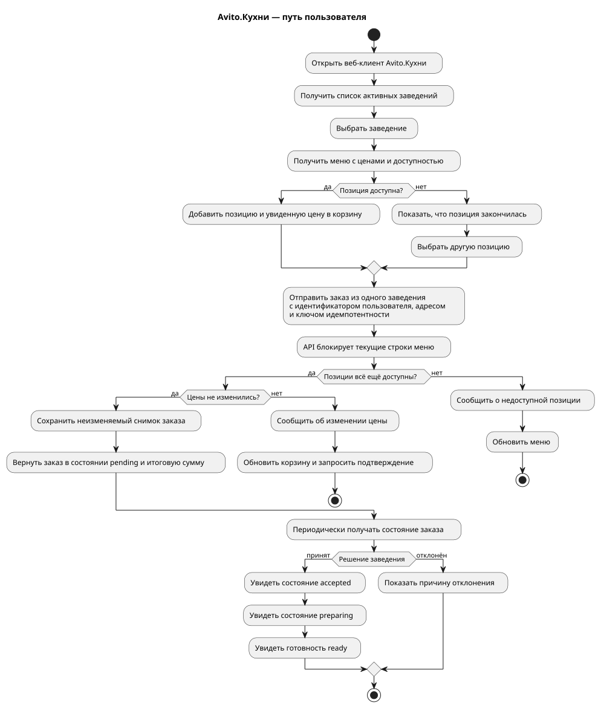
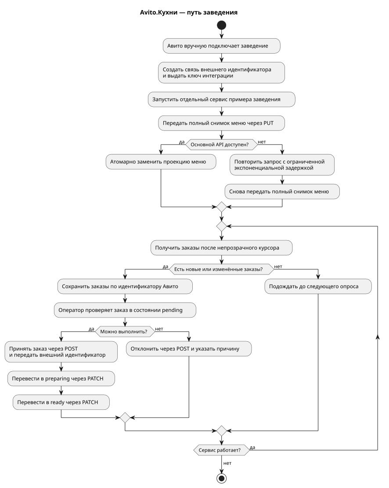
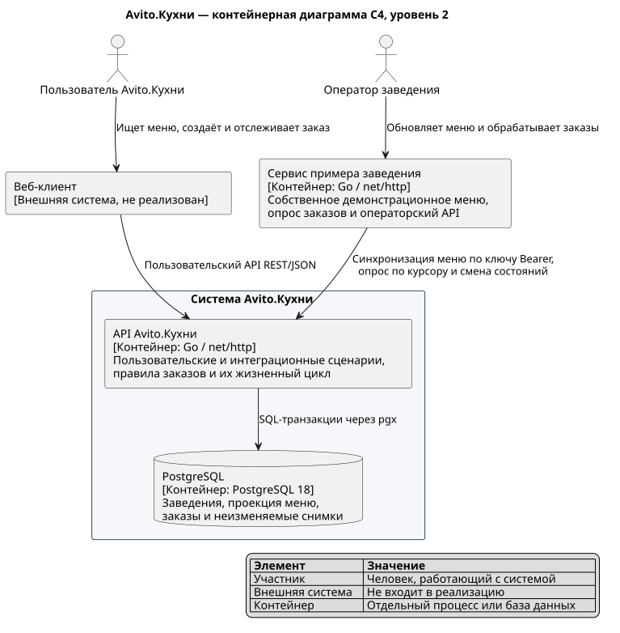
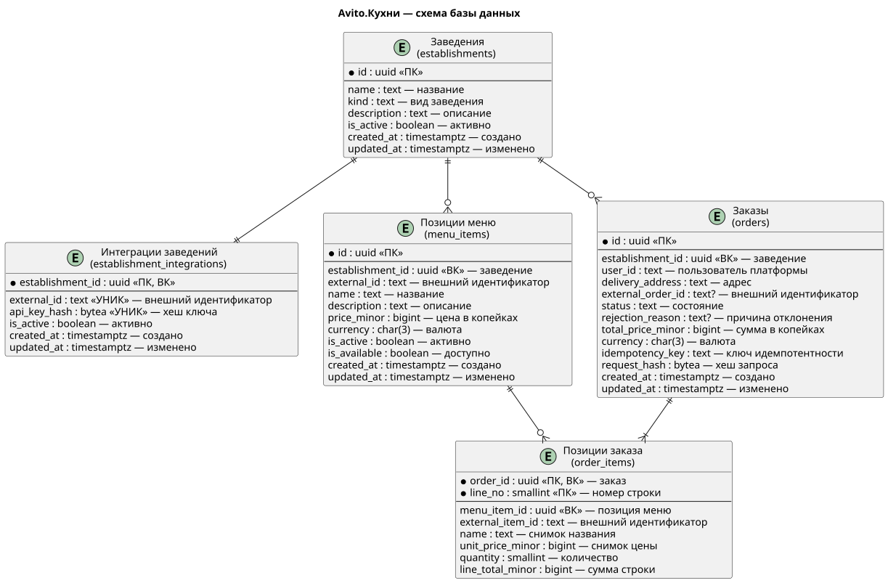

# Avito.Кухни

Серверная часть сервиса заказа еды для тестового задания на стажировку по серверной разработке в Avito 2026. Пользователь выбирает заведение и блюда, создаёт заказ и отслеживает его состояние. Подключённое заведение передаёт меню, получает заказы и меняет их состояние.

Исходное задание сохранено без изменений в [`backend-trainee-assignment-autumn-2026.md`](backend-trainee-assignment-autumn-2026.md). Утверждённый до реализации план, требования и связь требований с тестами находятся в [`docs/spec.md`](docs/spec.md). Фактически выполненные проверки записаны в [`docs/implementation-status.md`](docs/implementation-status.md).

## Что реализовано

Пользовательский API позволяет:

- получить список активных заведений и их меню;
- увидеть цену и доступность каждой позиции;
- создать заказ из одного заведения с защитой от повторной отправки;
- получить понятный конфликт, если цена изменилась или позиция закончилась;
- читать неизменяемый состав заказа и отслеживать его состояние.

Закрытый API заведения позволяет:

- заменить меню полным снимком;
- получить новые и изменённые заказы по курсору;
- принять или отклонить заказ;
- провести принятый заказ через состояния `accepted → preparing → ready`.

Второй запускаемый сервис, пример заведения, синхронизирует меню, опрашивает основной API и предоставляет локальный операторский API. Пользовательский интерфейс и аутентификация пользователей по условию задания не реализованы; `user_id` считается идентификатором пользователя основной платформы.

## Пути пользователя и заведения

Диаграммы созданы из хранящихся в репозитории исходников PlantUML.

### Пользователь



Цена и доступность проверяются повторно в транзакции создания заказа, поэтому устаревшая корзина не становится источником истины.

### Заведение



Заказ сначала сохраняется в PostgreSQL, а затем забирается заведением. Временная недоступность сервиса заведения не приводит к потере заказа.

## Архитектура

Основной API реализован как модульный монолит на Go. Пример заведения — отдельный процесс. PostgreSQL является единственным долговременным источником истины.



Внутри основного сервиса зависимости направлены к предметной области:

```text
HTTP и PostgreSQL → прикладной слой → предметная область
```

- `internal/kitchen/domain` — расчёт суммы, снимок заказа и машина состояний;
- `internal/kitchen/application` — сценарии использования и границы хранилища;
- `internal/kitchen/postgres` — SQL и транзакции через `pgx`;
- `internal/kitchen/httpapi` — HTTP-контракт, валидация и отображение ошибок;
- `internal/exampleestablishment` — меню, опрос заказов и операторский API примера заведения.

OpenAPI связывает контракт с реализацией через генерируемые интерфейсы и модели. В проекте нет ORM, контейнера внедрения зависимостей, брокера сообщений и универсальных слоёв репозитория.

## База данных



| Таблица | Назначение |
|---|---|
| `establishments` | Заведения площадки |
| `establishment_integrations` | Внешние идентификаторы и хеши ключей интеграции |
| `menu_items` | Текущее меню, цены и доступность |
| `orders` | Заказы, состояние и ключ идемпотентности |
| `order_items` | Неизменяемые снимки названий, цен и количества |

Деньги хранятся целыми копейками в `BIGINT`. Ограничения предметной области дополнительно закреплены внешними ключами, `NOT NULL`, `CHECK` и уникальными ограничениями. Схема создаётся только версионированными SQL-миграциями из [`migrations`](migrations); демонстрационные данные отделены в [`db/seed/demo.sql`](db/seed/demo.sql).

## API

Фактический контракт: [`api/openapi.yaml`](api/openapi.yaml), OpenAPI 3.0.3.

| Сторона | Операции |
|---|---|
| Пользователь | `GET /api/v1/establishments`, `GET /api/v1/establishments/{id}/menu`, `POST /api/v1/orders`, `GET /api/v1/orders`, `GET /api/v1/orders/{id}` |
| Заведение | `PUT /integration/v1/menu`, `GET /integration/v1/orders`, `POST /integration/v1/orders/{id}/decision`, `PATCH /integration/v1/orders/{id}/status` |

API заведения защищён отдельным ключом `Authorization: Bearer <integration-key>` и всегда ограничивает данные владельцем ключа. Ошибки имеют стабильный код и не раскрывают сведения PostgreSQL или сети.

## Запуск и проверка

Нужен Docker с Compose:

```bash
docker compose up --build --wait
docker compose ps
```

- основной API: `http://localhost:8080`;
- операторский API примера заведения: `http://localhost:8081`;
- демонстрационный ключ интеграции: `demo-establishment-key`.

Ключ и операторский API предназначены только для локальной проверки. Остановка без удаления данных: `docker compose down`.

Полный воспроизводимый набор проверок:

```bash
make verify
```

Он запускает форматирование, проверку воспроизводимости генерации, `go test ./...`, проверку гонок, `go vet`, `golangci-lint`, проверку OpenAPI и диаграмм, тесты с реальным PostgreSQL и сквозной сценарий через оба HTTP-сервиса. Обычная команда `go test ./...` также работает отдельно и не требует Docker; интеграционные и сквозные тесты запускаются целями `make test-integration` и `make test-e2e`.

## Ключевые решения и ограничения

- Заказ содержит снимок названий и цен: последующее изменение меню не меняет историю.
- Создание заказа блокирует читаемые строки меню и повторно проверяет цену и доступность.
- Курсор строится по устойчивой паре `(updated_at, order_id)`; конкурентное обновление может дать повтор, но не пропуск заказа.
- Опрос заведением выбран вместо сетевого вызова в пользовательском запросе: это проще и надёжнее для данного MVP.
- Redis не запрещён заданием, но здесь не решает подтверждённую проблему. Индексированного PostgreSQL достаточно, а идемпотентность, заказы и доступность должны оставаться транзакционно согласованными. Кэш следует добавлять только после измерения нагрузки.
- Количественные остатки не моделируются: доступность — логический признак, а заведение может отклонить ещё не принятый заказ.

За границами MVP остаются оплата, курьеры и доставка после `ready`, геопоиск, количественное резервирование остатков, заказ из нескольких заведений, уведомления, пользовательская аутентификация и самостоятельное подключение заведений.
